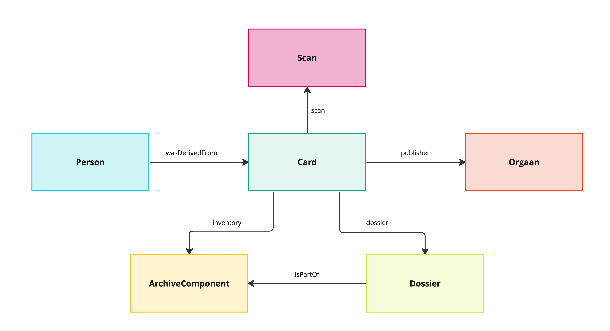

# Applicatie profiel voor Oorlog voor de Rechter

Oorlog voor de Rechter hergebruikt een aantal bestaande schema's zoals [schema.org](http://schema.org) en [SKOS](https://www.w3.org/TR/2009/REC-skos-reference-20090818/). De extra types en relaties die nodig zijn voor het project hebben we gedefinieerd als [extensie van schema.org](./schema_ext-ovdr.ttl). 

De volledige set van types en properties zijn vastgelegd in een [jsonld context file](./jsonldcontext.jsonld). Raadpleeg de [documentatie](https://indischerfgoed.github.io/schema/) voor een leesbare weergave.

Hieronder beschrijven we het model in hoofdlijnen. 

## Card
De kaarten koppelen in de fysieke wereld de inventarissen aan personen en organen. 

## Casus
De casus omschrijft het juridische proces / rechtsgang van een verdachte en koppelt deze aan de inventarissen. 

## Person
Een persoon kan op meerdere manieren gekoppeld worden aan entiteiten binnen het datamodel.

## Document
Een document valt binnen een inventaris en een casus. Via het documenttype wordt deze gekoppeld aan een specifiek event binnen het juridische proces / rechtsgang.

